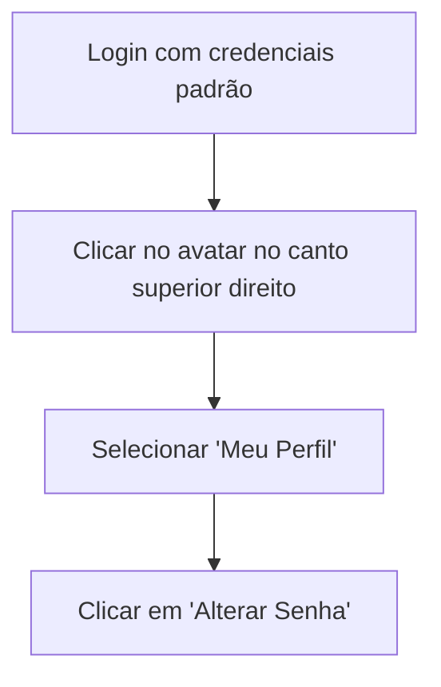

# 🎯 Primeiro Acesso ao Sistema

!!! info "Bem-vindo ao Sistema Sol Maior!"

    Parabéns pela instalação! Este guia irá ajudá-lo a fazer o primeiro acesso e configurar as funcionalidades básicas.

## 🔐 Login Inicial

### Credenciais Padrão

Após a instalação, use estas credenciais para o primeiro acesso:

- **Usuário**: `admin@solmaior.com`
- **Senha**: `admin123`

!!! warning "Importante!"

    **Altere a senha imediatamente após o primeiro login!** A senha padrão é conhecida e insegura.

### Processo de Login

1. **Acesse o sistema** através do navegador: `http://seu-dominio.com`
2. **Digite as credenciais** na tela de login
3. **Clique em "Entrar"**

## 🔑 Alterar Senha do Administrador

### Passo 1: Acessar Perfil



### Passo 2: Definir Nova Senha

Preencha o formulário:

- **Senha atual**: `admin123`
- **Nova senha**: Escolha uma senha forte (mínimo 8 caracteres)
- **Confirmar senha**: Digite a mesma senha novamente

!!! tip "Dicas para Senha Segura"

    - Use pelo menos 12 caracteres
    - Inclua letras maiúsculas e minúsculas
    - Adicione números e símbolos
    - Evite palavras comuns ou datas pessoais

## 🏫 Configuração da Instituição

### Informações Básicas

1. **Acesse**: Menu lateral → **Admin** → **Configurações** → **Instituição**

2. **Configure**:
   - **Nome da escola**: Ex: "Escola de Música Sol Maior"
   - **CNPJ**: Número do CNPJ da instituição
   - **Endereço completo**: Rua, número, bairro, cidade, estado, CEP
   - **Telefone e email**: Contatos principais
   - **Website**: URL do site (se houver)

### Identidade Visual

1. **Logo**: Faça upload do logo da escola (PNG/JPG, máximo 2MB)
2. **Cores**: Defina as cores principais da identidade visual
3. **Favicon**: Ícone que aparece na aba do navegador

## 👥 Criar Usuários do Sistema

### Perfis de Usuário

O sistema possui 4 perfis principais:

| Perfil | Responsabilidades | Acesso |
|--------|------------------|---------|
| **Admin** | Controle total do sistema | Tudo |
| **Secretaria** | Gestão operacional diária | Alunos, agendamentos, financeiro básico |
| **Professor** | Ensino e acompanhamento | Suas aulas, alunos, progresso |
| **Aluno** | Portal pessoal | Suas aulas, pagamentos, progresso |

### Criar Primeiro Usuário da Secretaria

1. **Acesse**: Menu lateral → **Admin** → **Usuários**
2. **Clique**: "Novo Usuário"
3. **Preencha**:
   - **Nome completo**: Ex: "Maria Silva"
   - **Email**: `maria@escola.com`
   - **Perfil**: Secretaria
   - **Senha**: Defina uma senha temporária

!!! tip "Boas Práticas"

    - Use emails institucionais quando possível
    - Crie senhas temporárias e oriente os usuários a alterarem
    - Defina permissões mínimas necessárias

## 🎵 Configurar Instrumentos e Professores

### Adicionar Instrumentos

1. **Acesse**: Menu lateral → **Admin** → **Instrumentos**
2. **Adicione os principais**:
   - Piano
   - Violino
   - Violão
   - Canto
   - Teoria Musical
   - etc.

### Cadastrar Professores

1. **Acesse**: Menu lateral → **Admin** → **Usuários** → **Novo Usuário**
2. **Selecione perfil**: Professor
3. **Configure**:
   - **Instrumento principal**: Ex: Piano
   - **Especializações**: Ex: Piano Clássico, Jazz
   - **Valor da hora/aula**: Ex: R$ 50,00
   - **Disponibilidade**: Horários de trabalho

!!! example "Professor Completo"

    ```json
    {
      "name": "João Santos",
      "email": "joao@escola.com",
      "instrument": "Piano",
      "specializations": ["Piano Clássico", "Piano Popular"],
      "hourly_rate": 60.00,
      "availability": {
        "monday": ["08:00-12:00", "14:00-18:00"],
        "wednesday": ["08:00-12:00", "14:00-18:00"],
        "friday": ["08:00-12:00"]
      }
    }
    ```

## 🏢 Configurar Salas de Aula

### Adicionar Salas

1. **Acesse**: Menu lateral → **Admin** → **Salas**
2. **Clique**: "Nova Sala"
3. **Configure**:
   - **Nome**: Ex: "Sala 01 - Piano"
   - **Capacidade**: Ex: 1 (individual) ou 4 (grupo)
   - **Equipamentos**: Piano, mesa, cadeiras, etc.
   - **Disponibilidade**: Manhã, tarde, noite

!!! tip "Organização de Salas"

    - **Nomeie claramente**: Inclua número e instrumento principal
    - **Capacidade real**: Considere espaço físico
    - **Equipamentos**: Liste todos os itens disponíveis
    - **Manutenção**: Marque quando precisar de manutenção

## 💰 Configurar Financeiro

### Planos de Mensalidade

1. **Acesse**: Menu lateral → **Financeiro** → **Planos**
2. **Crie planos**:
   - **Individual**: R$ 150,00/mês (4 aulas)
   - **Duo**: R$ 100,00/mês (4 aulas compartilhadas)
   - **Grupo**: R$ 80,00/mês (4 aulas coletivas)

### Descontos Automáticos

1. **Acesse**: Menu lateral → **Financeiro** → **Descontos**
2. **Configure**:
   - **Frequência 100%**: 10% de desconto
   - **Irmãos**: 15% para segundo filho
   - **Pagamento antecipado**: 5% desconto

### Gateways de Pagamento

1. **Acesse**: Menu lateral → **Admin** → **Integrações**
2. **Configure os gateways** que deseja usar:
   - **Mercado Pago**: Access Token e Public Key
   - **PagSeguro**: Email e Token
   - **Stripe**: Secret Key e Publishable Key

!!! warning "Configuração de Produção"

    Para produção, sempre use as chaves de produção dos gateways, nunca as de teste!

## 📧 Configurar Notificações

### Templates de Email

1. **Acesse**: Menu lateral → **Admin** → **Notificações**
2. **Personalize os templates**:
   - **Lembrete de aula**: 24h antes
   - **Cobrança pendente**: 3 dias antes do vencimento
   - **Confirmação de matrícula**: Automaticamente

### Preferências Padrão

Defina as configurações padrão para novos usuários:

- **Lembretes de aula**: Email + Push
- **Alertas financeiros**: Email + SMS
- **Horários silenciosos**: 22h às 8h

## 📚 Políticas Acadêmicas

### Regras de Aula

1. **Acesse**: Menu lateral → **Admin** → **Políticas Acadêmicas**
2. **Configure**:
   - **Duração padrão**: 60 minutos
   - **Limites semanais**: Máximo por instrumento
   - **Política de reposição**: Automaticamente após falta
   - **Período de carência**: 15 minutos para atraso

### Sistema de Fila de Espera

1. **Ative** o sistema de fila
2. **Configure expiração**: 30 dias
3. **Defina prioridades**: Por ordem de chegada

## 🎭 Configurar Recitais (Opcional)

### Configurações Básicas

1. **Acesse**: Menu lateral → **Admin** → **Recitais**
2. **Configure**:
   - **Duração padrão**: 120 minutos
   - **Prazo de inscrição**: 7 dias antes
   - **Geração de certificados**: Automática
   - **Sistema de ingressos**: Gratuito ou pago

## ✅ Verificação Final

### Checklist de Configuração

- [ ] ✅ Senha do admin alterada
- [ ] ✅ Informações da instituição configuradas
- [ ] ✅ Pelo menos 1 usuário da secretaria criado
- [ ] ✅ Professores principais cadastrados
- [ ] ✅ Instrumentos configurados
- [ ] ✅ Salas de aula cadastradas
- [ ] ✅ Planos de mensalidade criados
- [ ] ✅ Pelo menos 1 gateway de pagamento configurado
- [ ] ✅ Templates de email personalizados
- [ ] ✅ Políticas acadêmicas definidas

### Teste das Funcionalidades

1. **Crie um aluno de teste**
2. **Agende uma aula experimental**
3. **Teste o sistema de pagamentos**
4. **Envie uma notificação de teste**
5. **Verifique os relatórios básicos**

## 🚀 Próximos Passos

### Capacitação da Equipe

1. **Treine os usuários** usando os [guias específicos](../user-guides/admin/dashboard.md)
2. **Defina responsabilidades** claras
3. **Crie procedimentos** internos
4. **Estabeleça rotinas** de backup

### Operação Contínua

1. **Monitore o sistema** regularmente
2. **Mantenha backups** atualizados
3. **Acompanhe métricas** de uso
4. **Planeje expansões** futuras

---

!!! success "Sistema Pronto para Uso!"

    Parabéns! Seu Sistema Sol Maior está configurado e pronto para transformar a gestão da sua escola de música.

!!! tip "Recursos Adicionais"

    - 📖 **Documentação completa**: Explore todos os recursos disponíveis
    - 🎓 **Treinamentos**: Agende sessões de capacitação para sua equipe
    - 💬 **Suporte**: Entre em contato conosco para dúvidas específicas
    - 📊 **Consultoria**: Avalie nossos serviços de implementação avançada

!!! info "Lembre-se"

    A configuração inicial é apenas o começo. O Sistema Sol Maior cresce junto com sua escola, adaptando-se às suas necessidades específicas.